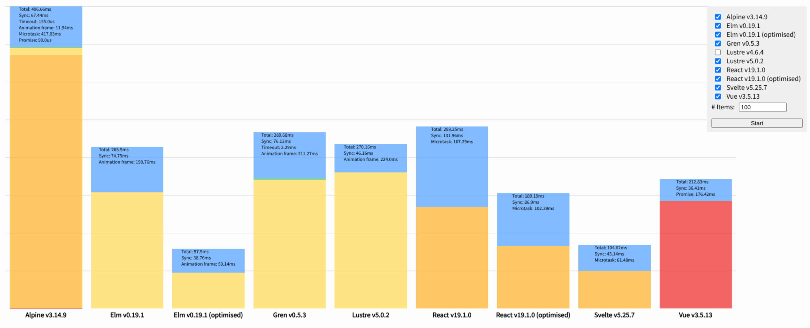
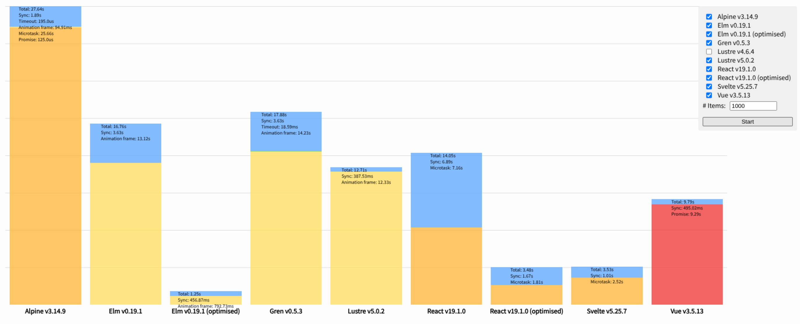

# Lustre Performance Comparison

## Background

This benchmark was inspired by Evan Czaplickis [performance comparison](https://github.com/evancz/react-angular-ember-elm-performance-comparison/),
which set out to measure the time various frameworks take in a somewhat realistic scenario.

[TodoMVC](https://todomvc.com) implementations were taken for - at the time -
popular competitors of Elm, namely React 15, Angular 2, and Ember 2. For each of
them, a basic runbook was executed: Add 100 items, check all items, and remove
the first item 100 times. During that, the _synchronous_ time - the time it
takes for the event to be dispatched - as well as one _asynchronous_ tick were
measured.

I claim that this methodology has several flaws giving an unfair advantage to Elm,
while at the same time mostly measuring "background noise".

- **Missing work:** The benchmark only measured the time between dispatching an
  event and a `setTimeout(0)` callback. This completely missed work done in
  `requestAnimationFrame` callbacks, which Elm in particular heavily relies on
  for rendering.
- **Issues with `setTimeout`:** The [HTML specification](https://html.spec.whatwg.org/multipage/timers-and-user-prompts.html#timers)
  requires a minimum 4ms delay for deeply nested timeouts. Since each benchmark
  step waited for a timeout completion before starting the next, this created an
  artificial 4ms delay between each operation. This delay is then measured as the
  "asynchronous" time each framework took.
- **Outdated:** The tested versions of React 15, Angular 2, and Ember 2 are now
  severely outdated and don't represent modern framework performance. In addition
  to that, Javascript framework code was not consistently pre-bundled.

## Our approach

we've redesigned the benchmark to capture all work performed by frameworks, and
only capture the work done by frameworks without including any extra browser
time:

All implementations are required to include a script adding instrumentation to
commonly-used async patterns: `requestAnimationFrame`, `setTimeout`,
`queueMicrotask`, and Promise callbacks. The provided callback is wrapped and
its execution time is measured using `performance.now()`. The resulting timings
are emitted as custom events. Implementations are loaded in an Iframe to ensure
the parent frame does not interfere with these timings, and special care was
taken to make sure that iframe is _Cross-origin isolated_, greatly improving the
accuracy of `performance.now`.

Measurements while the app is loading are skipped, and are continuously
collected independently from executing the runbook. Collection continues after
the runbook completes, until no more events have been captured for at least 2
frames.

We believe that this captures all of the work the different frameworks do.

We also updated the provided implementations to current versions and consistently
use the methodology recommended in their respective guides to build each app
for production.

## Results




Measurements were taken using an AMD Ryzen™ 7 1700X and Chromimum 135.0.7049.95,
running on NixOS 25.05. Lustre was built using Gleam 1.11.

> [!NOTE]
> At the time of writing, Gleam 1.11 has not yet been released; instead, this
> benchmark uses the _nightly_ pre-release of the compiler. We expect the final
> release to produce code at least as fast as the benchmarked nightly build and
> will validate this result once 1.11 releases. \
> Using Gleam 1.10 does not have a significant performance impact on the 100
> element benchmark, but is approximately 25% slower for 1000 elements.

All VDOM-based frameworks - Elm, Gren, Lustre 5, React, and Vue - are extremely
close, with variations in the single-digit millisecond range over the entire run
of the benchmark. Expectedly, frameworks comparing against the live DOM directly
(Alpine and Lustre 4) are noticably slower, while Sveltes direct DOM manipulations
give it a sizable advantage without any optimisations. Vues compiler manages to
automatically optimise some updates, making it slightly faster than unoptimised
VDOM implementations. Reacts performance can be doubled by structuring the
code more favourably and introducing `useCallback` and `memo` calls.

Using 1000 todos instead of 100 reveals differences in the individual performance
characteristics more clearly: All "optimised" implementations get even better
with that many elements; optimised Elm becomes over twice as fast as React
or Svelte. Lustre can increase its distance compared to React and Elm.

Notably, Elm still beats all other frameworks including Svelte with the
introduction of a single `lazy` call.

## Development

### Running the benchmark locally:

The benchmark repository includes all implementations precompiled, so only the
runner app has to be run locally.

This requires Gleam + a javascript runtime to be installed; you can start the
server by typing

```sh
gleam run -m serve
```

### Adding a implementation:

Implementations have to follow the following structure:

1. Add a directory in `priv/implementations` adhering to the following naming scheme: `$lowercaseName-$version`. If the implementation is optimised, add `-optimised`.
2. Inside the directory, make sure there is a `dist/index.html` file that uses _relative_ URLs to include all relevant scripts.
3. Your `dist/index.html` file is _required_ to include the following script tag:
  ```html
  <script src="/priv/instrumentation.js"></script>
  ```
4. Add your implementation to the `index.html` file in the root directory.

